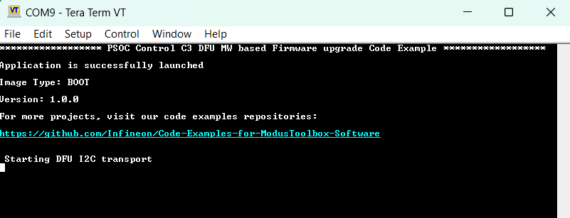
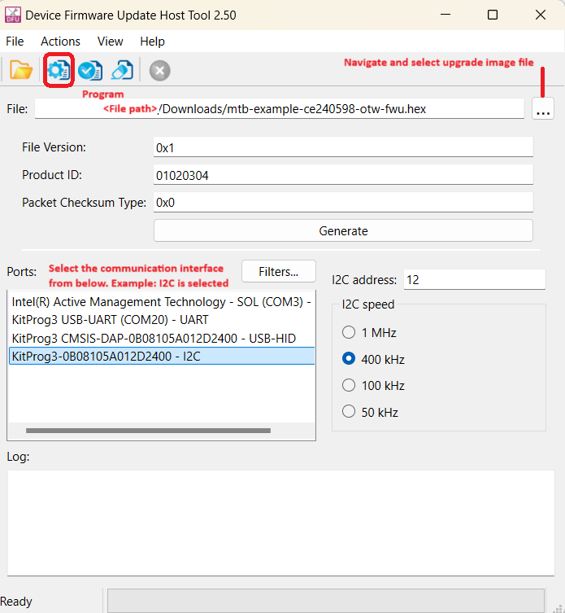
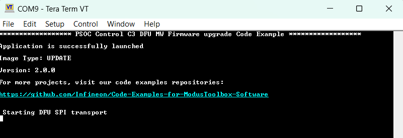
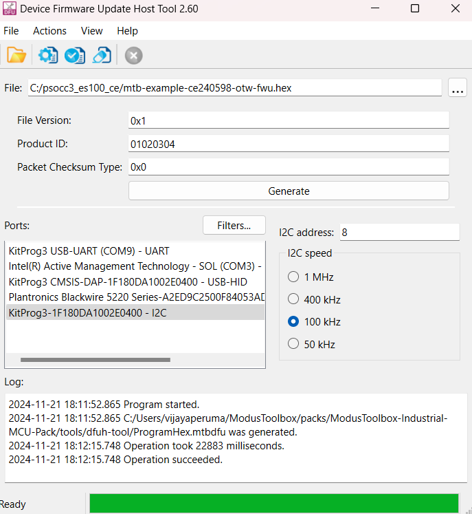
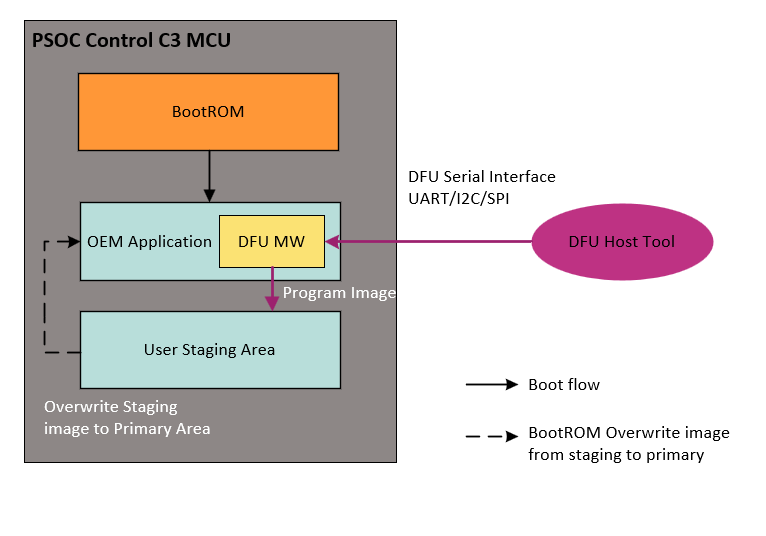

# PSOC&trade; Control MCU: Firmware upgrade through DFU MW 


This code example demonstrates how Infineon's Device Firmware Update Middleware (DFU) can be used to update firmware over various serial interfaces, such as UART, SPI, I2C, and CANFD. A host (typically a PC) running the DFU Host tool establishes a connection with the target device and downloads an application intended for the update. The images are downloaded to a staging region in the non-volatile memory. Once the application is successfully downloaded, the device resets to transfer control to the BootROM. Further, the BootROM validates the images in the staging region and installs them in the primary bootable region. This example also demonstrates support for UART, SPI, and CANFD interfaces, along with device configuration changes.


## Requirements

- [ModusToolbox&trade;](https://www.infineon.com/modustoolbox) v3.3 or later
- Programming language: C
- Associated parts: All PSOC&trade; Control C3 MCUs


## Supported toolchains (make variable 'TOOLCHAIN')

- GNU Arm&reg; Embedded Compiler v11.3.1 (`GCC_ARM`) – Default value of `TOOLCHAIN`
- Arm&reg; Compiler v6.22 (`ARM`)
- IAR C/C++ Compiler v9.50.2 (`IAR`)


## Supported kits (make variable 'TARGET')

- [PSOC&trade; Control C3 Evaluation Kit](https://www.infineon.com/KIT-PSC3M5-EVK) (`KIT_PSC3M5_EVK`)


## Hardware setup

This example uses the board's default configuration. Since the kitprog supports only UART and I2C serial interface, User needs to connect external miniProg, if they want to do firmware upgrade through SPI serial interface and additionally if they want to use CANFD, user needs to connect [PCAN USB Pro](https://www.peak-system.com/PCAN-USB-Pro.200.0.html). See the kit user guide to ensure that the board is configured correctly and for CANFD refer the [DFU Host Tool user guide](https://www.infineon.com/ModusToolboxDFUHostTool).

Ensure below jumper and pin configuration on board.
- Ensure the BootROM DFU port selection pins are serial disabled.
   > **Note:** For (`KIT_PSC3M5_EVK`) rev. **, DFU_SW1 and DFU_SW2 pins should be connected to Ground or High-Z position.

   > **Note:** I2C is used as default transport in the DFU application, make sure you establish connection as per I2C, unless changed during build time or plan to change at runtime.

- This CE requires to use both KitProg3 (on-board EVK `KIT_PSC3M5_EVK`) and MiniProg4 (external) to the PC.


## Software setup

See the [ModusToolbox&trade; tools package installation guide](https://www.infineon.com/ModusToolboxInstallguide) for information about installing and configuring the tools package.

Install a terminal emulator if you don't have one. Instructions in this document use [Tera Term](https://teratermproject.github.io/index-en.html).

<details><summary><b>ModusToolbox&trade; Edge Protect Security Suite</b></summary>

1. Download and install the [Infineon Developer Center Launcher](https://www.infineon.com/cms/en/design-support/tools/utilities/infineon-developer-center-idc-launcher/).
2. Login using your Infineon credentials.
3. Download and install the “ModusToolbox&trade; Edge Protect Security Suite” from Developer Center Launcher.
   > **Note:** The default installation directory of the Edge Protect Security Suite in Windows operating system is *C:/Users/`<USER>`/Infineon/Tools*.<br>
4. After installing the Edge Protect Security Suite, add the Edge Protect tools executable to system PATH variable
    Edge Protect tools executable is located in *<Edge-Protect-Security-Suite-install-path>/ModusToolbox-Edge-Protect-Security-Suite-`<version>`/tools/edgeprotecttools/bin*.

</details>

This example requires no additional software or tools.


### Create the project

The ModusToolbox&trade; tools package provides the Project Creator as both a GUI tool and a command line tool.

<details><summary><b>Use Project Creator GUI</b></summary>

1. Open the Project Creator GUI tool.

   There are several ways to do this, including launching it from the dashboard or from inside the Eclipse IDE. For more details, see the [Project Creator user guide](https://www.infineon.com/ModusToolboxProjectCreator) (locally available at *{ModusToolbox&trade; install directory}/tools_{version}/project-creator/docs/project-creator.pdf*).

2. On the **Choose Board Support Package (BSP)** page, select a kit supported by this code example. See [Supported kits](#supported-kits-make-variable-target).

   > **Note:** To use this code example for a kit not listed here, you may need to update the source files. If the kit does not have the required resources, the application may not work.

3. On the **Select Application** page:

   a. Select the **Applications(s) Root Path** and the **Target IDE**.

   > **Note:** Depending on how you open the Project Creator tool, these fields may be pre-selected for you.

   b. Select this code example from the list by enabling its check box.

   > **Note:** You can narrow the list of displayed examples by typing in the filter box.

   c. (Optional) Change the suggested **New Application Name** and **New BSP Name**.

   d. Click **Create** to complete the application creation process.

</details>


<details><summary><b>Use Project Creator CLI</b></summary>

The 'project-creator-cli' tool can be used to create applications from a CLI terminal or from within batch files or shell scripts. This tool is available in the *{ModusToolbox&trade; install directory}/tools_{version}/project-creator/* directory.

Use a CLI terminal to invoke the 'project-creator-cli' tool. On Windows, use the command-line 'modus-shell' program provided in the ModusToolbox&trade; installation instead of a standard Windows command-line application. This shell provides access to all ModusToolbox&trade; tools. You can access it by typing "modus-shell" in the search box in the Windows menu. In Linux and macOS, you can use any terminal application.

The following example clones the **Secure Firmware upgrade through user DFU MW** with the desired name "mtb-example-ce240598-otw-fwu" configured for the *`KIT_PSC3M5_EVK`* BSP into the specified working directory, *C:/mtb_projects*:

   ```
   project-creator-cli --board-id KIT_PSOCC3_EVK --app-id mtb-example-ce240598-otw-fwu --user-app-name otw-fwu --target-dir "C:/mtb_projects"
   ```


The 'project-creator-cli' tool has the following arguments:

Argument | Description | Required/optional
---------|-------------|-----------
`--board-id` | Defined in the <id> field of the [BSP](https://github.com/Infineon?q=bsp-manifest&type=&language=&sort=) manifest | Required
`--app-id`   | Defined in the <id> field of the [CE](https://github.com/Infineon?q=ce-manifest&type=&language=&sort=) manifest | Required
`--target-dir`| Specify the directory in which the application is to be created if you prefer not to use the default current working directory | Optional
`--user-app-name`| Specify the name of the application if you prefer to have a name other than the example's default name | Optional
<br>

> **Note:** The project-creator-cli tool uses the `git clone` and `make getlibs` commands to fetch the repository and import the required libraries. For details, see the "Project creator tools" section of the [ModusToolbox&trade; tools package user guide](https://www.infineon.com/ModusToolboxUserGuide) (locally available at {ModusToolbox&trade; install directory}/docs_{version}/mtb_user_guide.pdf).

</details>


### Open the project

After the project has been created, you can open it in your preferred development environment.


<details><summary><b>Eclipse IDE</b></summary>

If you opened the Project Creator tool from the included Eclipse IDE, the project will open in Eclipse automatically.

For more details, see the [Eclipse IDE for ModusToolbox&trade; user guide](https://www.infineon.com/MTBEclipseIDEUserGuide) (locally available at *{ModusToolbox&trade; install directory}/docs_{version}/mt_ide_user_guide.pdf*).

</details>


<details><summary><b>Visual Studio (VS) Code</b></summary>

Launch VS Code manually, and then open the generated *{project-name}.code-workspace* file located in the project directory.

For more details, see the [Visual Studio Code for ModusToolbox&trade; user guide](https://www.infineon.com/MTBVSCodeUserGuide) (locally available at *{ModusToolbox&trade; install directory}/docs_{version}/mt_vscode_user_guide.pdf*).

</details>


<details><summary><b>Keil µVision</b></summary>

Double-click the generated *{project-name}.cprj* file to launch the Keil µVision IDE.

For more details, see the [Keil µVision for ModusToolbox&trade; user guide](https://www.infineon.com/MTBuVisionUserGuide) (locally available at *{ModusToolbox&trade; install directory}/docs_{version}/mt_uvision_user_guide.pdf*).

</details>


<details><summary><b>IAR Embedded Workbench</b></summary>

Open IAR Embedded Workbench manually, and create a new project. Then select the generated *{project-name}.ipcf* file located in the project directory.

For more details, see the [IAR Embedded Workbench for ModusToolbox&trade; user guide](https://www.infineon.com/MTBIARUserGuide) (locally available at *{ModusToolbox&trade; install directory}/docs_{version}/mt_iar_user_guide.pdf*).

</details>


<details><summary><b>Command line</b></summary>

If you prefer to use the CLI, open the appropriate terminal, and navigate to the project directory. On Windows, use the command-line 'modus-shell' program; on Linux and macOS, you can use any terminal application. From there, you can run various `make` commands.

For more details, see the [ModusToolbox&trade; tools package user guide](https://www.infineon.com/ModusToolboxUserGuide) (locally available at *{ModusToolbox&trade; install directory}/docs_{version}/mtb_user_guide.pdf*).

</details>


## Provisioning

To use this code example, the device must be provisioned with the correct policy changes. Follow the steps below to provision the device.

1. Add policy and keys to the project.

   1. Ensure that you are in the *`<Workspace>/<CodeExampleName>`* directory.

   2. Execute the following command to add policy and keys to the project:
    ```
      edgeprotecttools -t psoc_c3 init
      ```

   > **Note:** After executing of the `init` command, all files that are required for provisioning will be copied into the *`<Workspace>/<CodeExampleName>`* directory, including the default policy for the chosen `<kit-name>`.

2. Add the keys to be used for provision of device into the project.

   Generate keys using the following commands:

   ```
   edgeprotecttools create-key --key-type ECDSA-P256 -o keys/oem_rot_priv_key_0.pem keys/oem_rot_pub_key_0.pem
   ````
   ```
   edgeprotecttools create-key --key-type ECDSA-P256 -o keys/oem_rot_priv_key_1.pem keys/oem_rot_pub_key_1.pem
   ```

3. OEM provisioning:

   The default OEM policy configures the device in the BOOT_SIMPLE_APP configuration. To perform a firmware upgrade, the OEM policy needs to be modified.


      "boot_cfg_id": {
      "description": "A behavior for BOOT_APP_LAYOUT (BOOT_SIMPLE_APP   applicable to NORMAL_PROVISIONED only)",
      "applicable_conf": "BOOT_SIMPLE_APP, BOOT_ONE_SLOT, BOOT_TWO_SLOTS, BOOT_THREE_SLOTS, BOOT_IDLE",
      "value": "BOOT_TWO_SLOT"
      },

   The boot_app_layout's first slot address should point to the user's primary application MCUboot header address (refer to policy/policy_oem_provisioning.json). The second slot should point to the user's secondary application MCUboot header address. 

      "boot_app_layout": {
         "description": "The memory layout for the applications defined by BOOT_CFG_ID. 0x32000000 - 0x33FFFFFF for secure addresses; 0x22000000 - 0x23FFFFFF for non-secure addresses",
         "value": [
            {
               "address": "0x32000000",
               "size": "0x10000"
            },
            {
               "address": "0x32010000",
               "size": "0x10000"
            },
            {
               "address": "0x00000000",
               "size": "0x00"
            }
         ]
      }

   Make sure the generated public key path right in the key section.
   
      "pre_build": {
         "keys": {
            "oem_rot_public_key_0": {
               "description": "Path to the OEM RoT public key 0",
               "value": "../keys/oem_rot_pub_key_0.pem"
            },
            "oem_rot_public_key_1": {
               "description": "Path to the OEM RoT public key 1",
               "value": "../keys/oem_rot_pub_key_1.pem"
            }
         }
      },

   Once the policy has been updated, provision the device with the updated policy.
   To provision the device, execute the following command
   ```
   edgeprotecttools -t psoc_c3 provision-device -p policy_oem_provisioning.json
   ```


## Operation

1. Connect the board to your PC using the provided USB cable through the KitProg3 USB connector.

2. Open a terminal program and select the KitProg3 COM port. Set the serial port parameters to 8N1 and 115200 baud.

3. Update the SECURED_BOOT to TRUE **SECURED_BOOT?=TRUE** in application's Makefile and clean build the application.

4. Build and program the device (Boot image) using one of the following:

   <details><summary><b>Using Eclipse IDE</b></summary>

      1. Select the application project in the Project Explorer.

      2. In the **Quick Panel**, scroll down, and click **\<Application Name> Program (KitProg3_MiniProg4)**.
   </details>


   <details><summary><b>In other IDEs</b></summary>

   Follow the instructions in your preferred IDE.
   </details>


   <details><summary><b>Using CLI</b></summary>

     From the terminal, execute the `make program` command to build and program the application using the default toolchain to the default target. The default toolchain is specified in the application's Makefile but you can override this value manually:
      ```
      make program TOOLCHAIN=<toolchain>
      ```

      Example:
      ```
      make program TOOLCHAIN=GCC_ARM
      ```
   </details>

5. After programming, the application starts automatically and confirms that "PSOC&trade; Control C3 DFU MW based Firmware upgrade Code Example Demonstration" is displayed on the UART terminal.

   **Figure 1. Terminal output on program startup**

   

6. Confirm that the kit LED1 starts blinking.

7. <details><summary><b> Performing firmware update </b></summary>

   The code example demonstrates firmware update over serial interfaces (I2C, SPI, UART, and CANFD). I2C is configured as the default interface in the instructions below. However, if you want to switch from I2C to another interface, you will have to change the hardware connection as mentioned in [Hardware Setup](#hardware-setup). To perform a firmware update using the DFU MW, follow the process:

   Preparing the firmware update images for PSOC&trade; Control OTW Update application

      1. Change **IMG_TYPE= BOOT** to **IMG_TYPE= UPDATE**  Macro in Makefile.mk
   
      2. Re-build all the project in code example
   
      3. Post build Script will pad the image magic trailer and add metadata for update image.

         > **Note:** Do not program this image. 

   <details> <summary><b>Downloading Update images to the device</b> </summary>
   
   1. Connect the USB cable from PC/Host Machine to on board Kitprog (I2C lines are by default routed through KitProg device) EVK.
   
   2. You can either use DFU Host Tool GUI or CLI interface to perform firmware update.

      <details><summary><b>Using DFU Host Tool GUI</b></summary>
         
         1. Open DFU Host Tool GUI(dfuh-tool.exe) from ModusToolbox&trade; IDE under Quick Panel Tools section.

         2. Select the **Program.Hex** file from **`<CE-dir>`**  as the input file to DFU Host Tool.
         
         3. Select the I2C serial interface with the required configuration as described in the [Design and implementation](#design-and-implementation) section.
         
         4. Click on Execute button in DFU Host Tool GUI.

         **Figure 2. DFU Host Tool GUI**
   
         

      </details>


      <details><summary><b>Using DFU Host Tool CLI</b></summary>
      
      1. Open the shell terminal, move to DFU Host Tool directory.
            <br> *install-path>/ModusToolbox/tools3.3/dfuh-tool*
   
      2. Execute the below DFU CLI command from the Host Tool directory in the shell terminal.

            ```
            dfuh-cli.exe --custom-command path-to-mtbdfu-file --hwid Probe-id/COM Port  --interface-params 
            ```
            For Example: To use I2C interface use the following command.
            ```
            dfuh-cli.exe --custom-command <CE-dir>//Program.mtbdfu --hwid KitProg3-151D0D2303210400 --i2c-speed 400 --i2c-address 53
            ```
            
         > **Note:** 
         >1. Above command is given for the default interface (I2C) configurations, change the above command as required for other interface/configurations.
         >2. Refer [DFU Host Tool for ModusToolbox&trade; user uide](https://www.infineon.com/ModusToolboxDFUHostTool) for more details on other interface.
      </details>
      
   4. After successful downloading the image to device, DFU application triggers a system reset to initiate the BootROM for performing the update.
   
   5. BootROM validates the downloaded image and overwrites it into the primary slot on successful authentication, and then launches the application.
   
      > **Note:** Above process uses I2C as communication for performing firmware update, refer [Switching DFU interface](#switching-dfu-interface) for switching DFU Transport interface.


      **Figure 3. Terminal output of update image**

      

   6. Confirm that the kit LED2 starts blinking.

       **Figure 4. DFU Host Tool output of update image**

      


      > **Note:** To restore the device to its default configuration for executing other code examples or projects, re-provision the device with the default policy_oem_provisioning.json policy. 

   </details>
   </details>


## Debugging

You can debug the example to step through the code.


<details><summary><b>In Eclipse IDE</b></summary>

Use the **\<Application Name> Debug (KitProg3_MiniProg4)** configuration in the **Quick Panel**. For details, see the "Program and debug" section in the [Eclipse IDE for ModusToolbox&trade; user guide](https://www.infineon.com/MTBEclipseIDEUserGuide).


</details>


<details><summary><b>In other IDEs</b></summary>

Follow the instructions in your preferred IDE.

</details>


## Design and implementation

In this code example, the BootROM launches the primary user application, which consists of DFU initialization and firmware download logic using the DFU middleware API.

**Figure 5. Code example boot flow**




The moment the application starts executing, it initializes the DFU and starts the firmware download logic, which is a super loop-based design, and waits for the DFU packet from the DFU Host tool. The device receives data sent from the DFU Host tool in chunks. Further, this chunk data is validated (crc32) and accumulated in a buffer until 512 bytes of data are received. Once the buffer reaches 512 bytes, it programs the corresponding row(s) of device memory at once. While downloading the firmware, the device also blinks an LED using a counter-based logic. After the successful completion of the firmware download, the project triggers a system reset to kick in the BootROM, which completes the firmware update process and launches the new application on successful validation.


### Switching DFU interface

This code example uses I2C as the default interface. However, users can change to UART, SPI, or CANFD interfaces by making the following changes in the code and rebuilding to support the selected interface.

  1. Configure the interface in the device configurator.
  2. Initializes the interface (HALNext and PDL) API's in the code. Refer mtb_shared/dfu/release-v6.0.0/docs/html/index.html for device configuration.
  3. For CANFD interface do the following changes:
      1. Include the *transport_canfd.h* file in the *main.c* file.
      2. Update dfu_transport_str array for "CANFD".
      3. Add new case for CANFD in the check_transport function similar to other interfaces.
      4. Add DFU_CANFD in the COMPONENTS field.
  4. Build and run the application again.


### DFU serial interfaces

The code example supports serial interfaces, including I2C, UART, SPI, and CANFD, for communicating with the DFU host/PC. <br> See **Table 1** for the default configuration details. You must ensure that the configuration of the DFU host tool matches as defined:

**Table 1. Serial transport configurations**
    
  DFU transport: I2C| Default |Description
   :--------------- | :------ | :-----
   Address          | 53      | 7-bit slave device address
   Data rate        |400 kbps | DFU supports standard data rates from 50 kbps to 1 Mbps
   <br>

   DFU transport: UART| Default |Description
   :----------------- | :------- | :-----
   Baud rate(bps)     |115200    | Supports standard baud rates from 19200 to 115200
   Data width         | 8 bits   | Standard frame
   Parity             | None     | Standard frame
   Stop bits          | 1 bit    | Standard frame
   Bit order          | LSB first| Standard frame
   <br>

   DFU transport: SPI | Default  |Description
   :------------------| :------  | :-----
   Shift direction    | MSB first| default direction set as MSB first  
   Clock speed        | 1 MHz    | DFU supports 1 MHz SPI Clock speed
   Mode               | Mode 00  | default mode set as Mode 00
   <br>

   DFU transport: CANFD | Default  |Description
   :--------------------| :------  | :-----
   Bitrate(kbit/s)      | 1000     | Sets the communication bitrate  
   Data Bitrate(kbit/s) | 2000     | Sets data communication bitrate
   Output frame ID      | 0x10     | Sets output frame ID
   Input frame ID       | 0x11     | Sets input frame ID (optional)
   Bitrate switch       | check    | Enables switching between default and data bitrates
   <br>


### Resources and settings

**Table 2. Application resources**

 Resource  |  Alias/object     |    Purpose
 :--------------------| :--------------------| :----------------------------------
 UART (HAL) |cy_retarget_io_uart_obj | UART HAL object used by Retarget-IO for the Debug UART port
 GPIO (HAL)    | CYBSP_USER_LED     | User LED
<br>


## Related resources

Resources  | Links
-----------|----------------------------------
Application notes  | [AN238329](https://www.infineon.com/AN238329) – Getting started with PSOC&trade; Control C3 MCU on ModusToolbox&trade; <br> [AN235935](https://www.infineon.com/AN235935) – Device Firmware Update (DFU) Middleware (MW) for ModusToolbox&trade; <br> [TODO](https://www.infineon.com/dgdl/Infineon-ModusToolbox_TM_DFU_Host_tool_user_guide-UserManual-v13_00-EN.pdf?fileId=8ac78c8c914a3ac801917e9c2a283218) – DFU Host tool user guide 
Code examples  | [Using ModusToolbox&trade;](https://github.com/Infineon/Code-Examples-for-ModusToolbox-Software) on GitHub
Device documentation | [PSOC&trade; 6 MCU datasheets](https://documentation.infineon.com/html/psoc6/bnm1651211483724.html) <br> 
Development kits | Select your kits from the [Evaluation board finder](https://www.infineon.com/cms/en/design-support/finder-selection-tools/product-finder/evaluation-board).
Libraries on GitHub  | [mtb-pdl-cat1](https://github.com/Infineon/mtb-pdl-cat1) – Peripheral Driver Library (PDL)  <br> [mtb-hal-cat1](https://github.com/Infineon/mtb-hal-cat1) – Hardware Abstraction Layer (HAL) library <br> [retarget-io](https://github.com/Infineon/retarget-io) – Utility library to retarget STDIO messages to a UART port 
Middleware on GitHub  | [CAPSENSE&trade;](https://github.com/Infineon/capsense) – CAPSENSE&trade; library and documents <br> [psoc6-middleware](https://github.com/Infineon/modustoolbox-software#psoc-6-middleware-libraries) – Links to all PSOC&trade; 6 MCU middleware
Tools  | [ModusToolbox&trade;](https://www.infineon.com/modustoolbox) – ModusToolbox&trade; software is a collection of easy-to-use libraries and tools enabling rapid development with Infineon MCUs for applications ranging from wireless and cloud-connected systems, edge AI/ML, embedded sense and control, to wired USB connectivity using PSOC&trade; Industrial/IoT MCUs, AIROC&trade; Wi-Fi and Bluetooth&reg; connectivity devices, XMC&trade; Industrial MCUs, and EZ-USB&trade;/EZ-PD&trade; wired connectivity controllers. ModusToolbox&trade; incorporates a comprehensive set of BSPs, HAL, libraries, configuration tools, and provides support for industry-standard IDEs to fast-track your embedded application development.
<br>


## Other resources

Infineon provides a wealth of data at [www.infineon.com](https://www.infineon.com) to help you select the right device, and quickly and effectively integrate it into your design.


## Document history

Document title: *CE240598* – *PSOC&trade; Control MCU: Firmware upgrade through DFU MW*

 Version | Description of change
 ------- | ---------------------
 1.0.0   |  New code example
<br>


All referenced product or service names and trademarks are the property of their respective owners.

The Bluetooth&reg; word mark and logos are registered trademarks owned by Bluetooth SIG, Inc., and any use of such marks by Infineon is under license.


---------------------------------------------------------

© Cypress Semiconductor Corporation, 2024. This document is the property of Cypress Semiconductor Corporation, an Infineon Technologies company, and its affiliates ("Cypress").  This document, including any software or firmware included or referenced in this document ("Software"), is owned by Cypress under the intellectual property laws and treaties of the United States and other countries worldwide.  Cypress reserves all rights under such laws and treaties and does not, except as specifically stated in this paragraph, grant any license under its patents, copyrights, trademarks, or other intellectual property rights.  If the Software is not accompanied by a license agreement and you do not otherwise have a written agreement with Cypress governing the use of the Software, then Cypress hereby grants you a personal, non-exclusive, nontransferable license (without the right to sublicense) (1) under its copyright rights in the Software (a) for Software provided in source code form, to modify and reproduce the Software solely for use with Cypress hardware products, only internally within your organization, and (b) to distribute the Software in binary code form externally to end users (either directly or indirectly through resellers and distributors), solely for use on Cypress hardware product units, and (2) under those claims of Cypress's patents that are infringed by the Software (as provided by Cypress, unmodified) to make, use, distribute, and import the Software solely for use with Cypress hardware products.  Any other use, reproduction, modification, translation, or compilation of the Software is prohibited.
<br>
TO THE EXTENT PERMITTED BY APPLICABLE LAW, CYPRESS MAKES NO WARRANTY OF ANY KIND, EXPRESS OR IMPLIED, WITH REGARD TO THIS DOCUMENT OR ANY SOFTWARE OR ACCOMPANYING HARDWARE, INCLUDING, BUT NOT LIMITED TO, THE IMPLIED WARRANTIES OF MERCHANTABILITY AND FITNESS FOR A PARTICULAR PURPOSE.  No computing device can be absolutely secure.  Therefore, despite security measures implemented in Cypress hardware or software products, Cypress shall have no liability arising out of any security breach, such as unauthorized access to or use of a Cypress product. CYPRESS DOES NOT REPRESENT, WARRANT, OR GUARANTEE THAT CYPRESS PRODUCTS, OR SYSTEMS CREATED USING CYPRESS PRODUCTS, WILL BE FREE FROM CORRUPTION, ATTACK, VIRUSES, INTERFERENCE, HACKING, DATA LOSS OR THEFT, OR OTHER SECURITY INTRUSION (collectively, "Security Breach").  Cypress disclaims any liability relating to any Security Breach, and you shall and hereby do release Cypress from any claim, damage, or other liability arising from any Security Breach.  In addition, the products described in these materials may contain design defects or errors known as errata which may cause the product to deviate from published specifications. To the extent permitted by applicable law, Cypress reserves the right to make changes to this document without further notice. Cypress does not assume any liability arising out of the application or use of any product or circuit described in this document. Any information provided in this document, including any sample design information or programming code, is provided only for reference purposes.  It is the responsibility of the user of this document to properly design, program, and test the functionality and safety of any application made of this information and any resulting product.  "High-Risk Device" means any device or system whose failure could cause personal injury, death, or property damage.  Examples of High-Risk Devices are weapons, nuclear installations, surgical implants, and other medical devices.  "Critical Component" means any component of a High-Risk Device whose failure to perform can be reasonably expected to cause, directly or indirectly, the failure of the High-Risk Device, or to affect its safety or effectiveness.  Cypress is not liable, in whole or in part, and you shall and hereby do release Cypress from any claim, damage, or other liability arising from any use of a Cypress product as a Critical Component in a High-Risk Device. You shall indemnify and hold Cypress, including its affiliates, and its directors, officers, employees, agents, distributors, and assigns harmless from and against all claims, costs, damages, and expenses, arising out of any claim, including claims for product liability, personal injury or death, or property damage arising from any use of a Cypress product as a Critical Component in a High-Risk Device. Cypress products are not intended or authorized for use as a Critical Component in any High-Risk Device except to the limited extent that (i) Cypress's published data sheet for the product explicitly states Cypress has qualified the product for use in a specific High-Risk Device, or (ii) Cypress has given you advance written authorization to use the product as a Critical Component in the specific High-Risk Device and you have signed a separate indemnification agreement.
<br>
Cypress, the Cypress logo, and combinations thereof, ModusToolbox, PSoC, CAPSENSE, EZ-USB, F-RAM, and TRAVEO are trademarks or registered trademarks of Cypress or a subsidiary of Cypress in the United States or in other countries. For a more complete list of Cypress trademarks, visit www.infineon.com. Other names and brands may be claimed as property of their respective owners.
